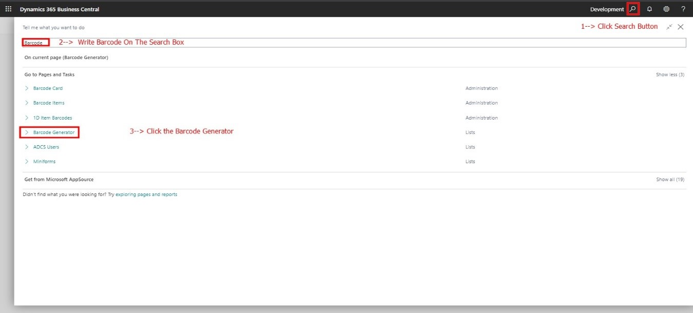
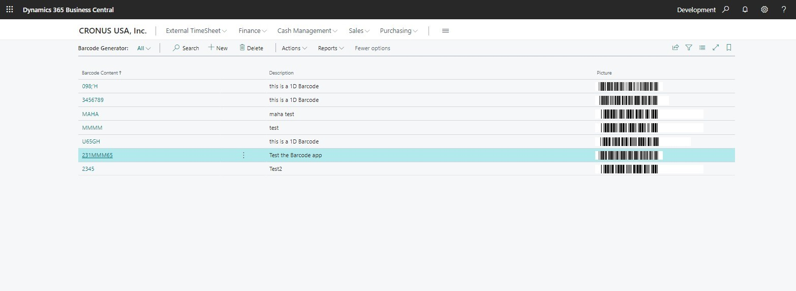
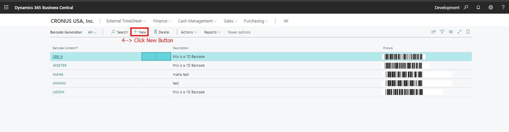
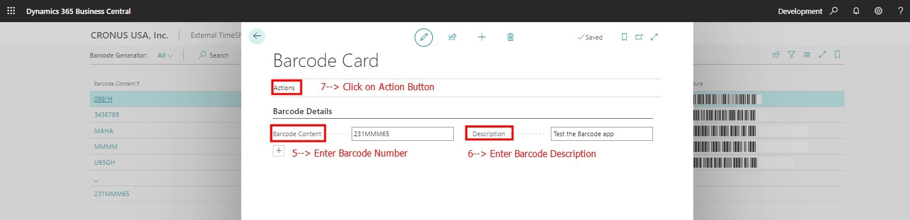
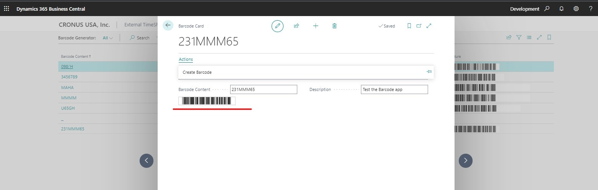
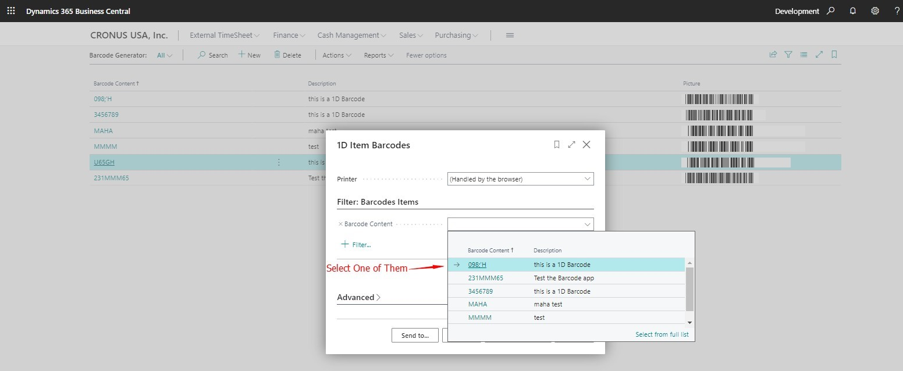
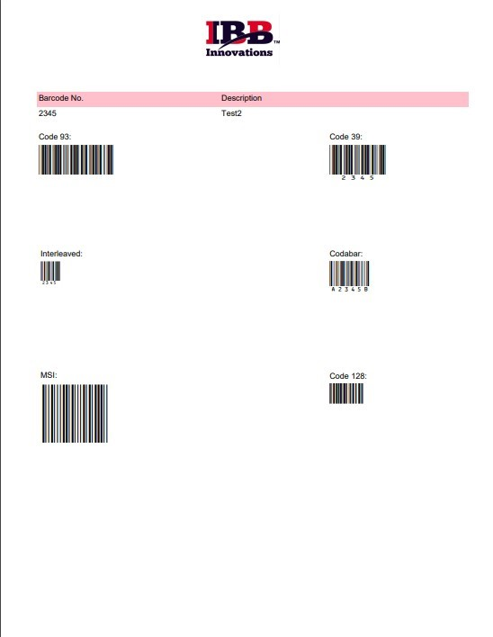
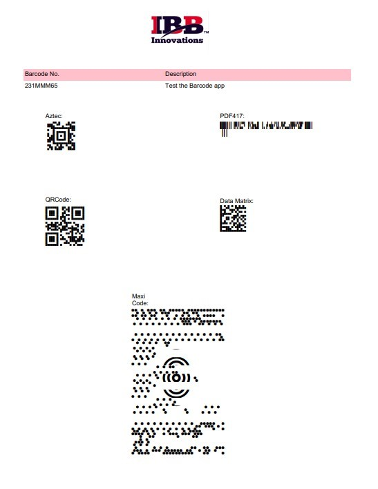

# AL-1D-2D-Barcode-Project
Barcode Generator is a simple Barcode solution designed and developed by IBB Innovations, LLC. it is used to help the employees to create or generate barcodes. In addition, the employer can generate different types of 1D or 2D barcodes. Easy, simple, and flexible system to manage performance.   Features:  An action, where you can generate a 1D barcode on the same page or within the Business Central. Also, Reports where you can generate different types of 1D barcodes. In addition, Reports where you can generate different types of2D barcodes. Supported Editions: The app supports the Essentials and Premium Editions of Microsoft Dynamics 365 Business Central.     Supported Countries: This app is available globally.  Supported Languages: This app is available in English (United States). 

Key scenarios:

•	The first thing the user should click the search button in the action bar of the role center as shown in the screenshot blow. Then the user starts writing barcode on the search box. After that it will show a dropdown list with button to open the Barcode Generator. 

•	After opening the Barcode Generator, it will view the list of the employees’ Barcodes as shown blow. 

•	 The user can enter a new barcode by click on the new button.
 

•	When the user clicks new it will open a card to fill the information. The user should enter the barcode number in order to generate 1D barcode.

•	After user clicks action new button will appear called “Create Barcode “user will click on it in order to generate auto 1D barcode.

 
•	 In additional, the employer can generate different types of 1D or 2D barcodes by clicking on the report button.

•	When the user clicks report it will open a card to select the barcode number.

 
•	Last thing, user will be allowed to print list of 1D or 2D barcodes.

                                                1D Barcode                                                                                                              
                                                
                                            
                                                
                                                2D Barcode
